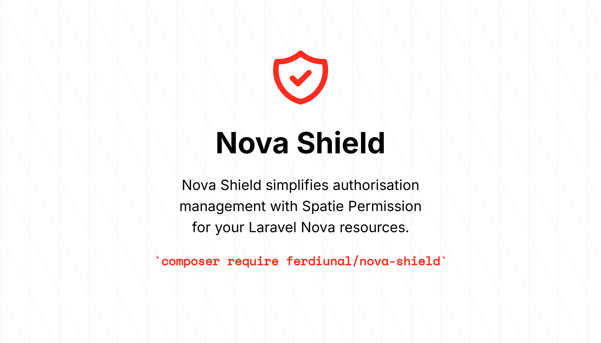
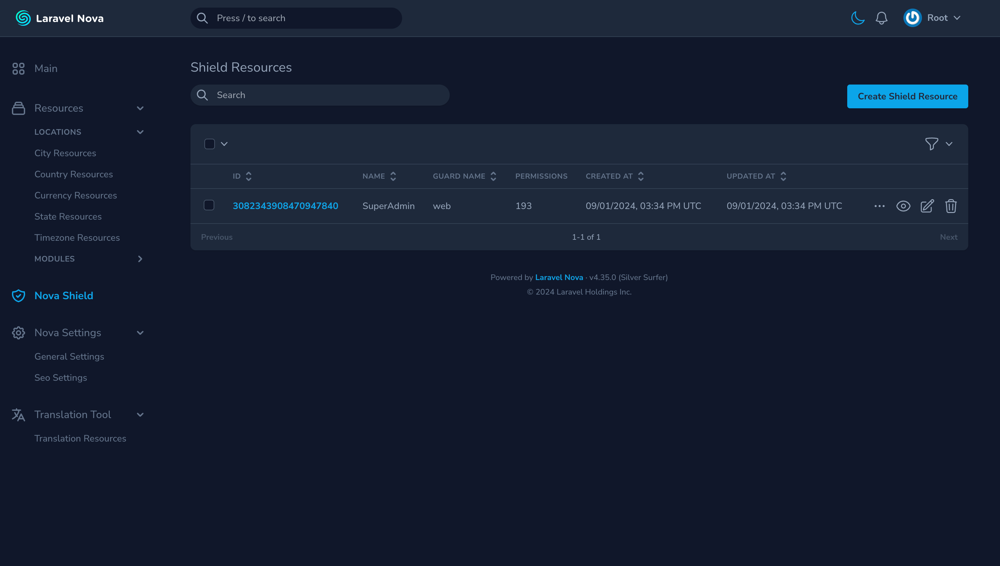
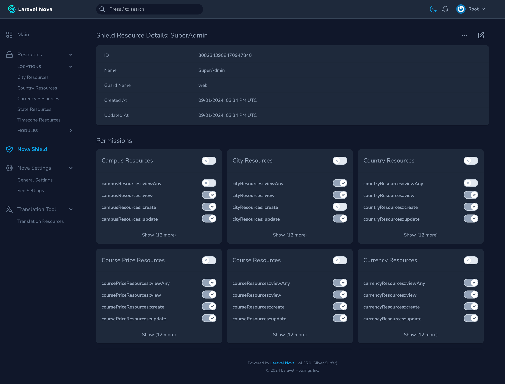
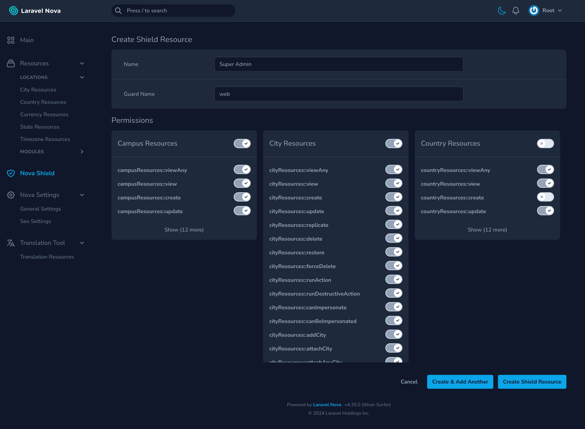

# Nova Shield - WIP



**Nova Shield** simplifies permission management for your [Laravel Nova](https://nova.laravel.com) resources using [Spatie Permission](https://github.com/spatie/laravel-permission). Easily grant or revoke access to specific resources and actions, streamlining your workflow and improving security.

## Installation

```bash
composer require ferdiunal/nova-shield
```

## Configuration

Optionally, you can publish the configuration file using this command:

```bash
php artisan vendor:publish --tag nova-shield-config
```

Then let's run the migration commands required by the package below.

```bash
php artisan vendor:publish --tag nova-shield-migrations
php artisan migrate
````

In the config file, you can control resource permissions by specifying the resources parameter with either the path to the Nova resources folder or a string class path. 

For example, in the code below, we define the resources and their corresponding policies:

<details>
  <summary>Show Code </summary>

```php
<?php

return [
    /**
     * Specify the resources that will be used in the project.
     * If you want to use custom resources, you can add them to the list.
     */
    'resources' => [
        app_path('Nova'),
        \Ferdiunal\NovaShield\Http\Nova\ShieldResource::class,
        // Custom resource: For custom menu items
        // [
        //     "name" => "Custom Menu Item",
        //     "prefix" => "customMenuItem::",
        //     "policies" => ["CustomMenuPolicy"] // Add custom menu policies here
        // ]
    ],

    // 'teamFields' => \App\Lib\TeamField::class,

    /**
     * Constant policies of Laravel Nova
     */
    'policies' => [
        'viewAny',
        'view',
        'create',
        'update',
        'replicate',
        'delete',
        'restore',
        'forceDelete',
        'runAction',
        'runDestructiveAction',
        'canImpersonate',
        'canBeImpersonated',
        'add{Model}',
        'attach{Model}',
        'attachAny{Model}',
        'detach{Model}',
    ],

    /**
     * Specify the file path of each language files for authorisations.
     */
    'langs' => [
        // lang_path('en/nova-shield.json'),
        // base_path('langs/en/nova-shield.json'),
    ],

    /**
     * Default Super admin role name and guard
     */
    'superAdmin' => [
        'name' => 'super-admin',
        'guard' => 'web',
    ],

    'hooks' => [
        /**
         * When matching permissions with roles, upsert is used by default.
         * If you are using custom ID types like UUID or ULID, you need to include them in the upsert operation.
         * Therefore, you can write and use a query that suits your project needs.
         */
        'permission' => \Ferdiunal\NovaShield\Lib\DefaultPermissionHook::class,
    ],
];

```
</details>

### Custom Menu Configuration

The main purpose of the package was to manage permissions for Nova Resources, but I realized there was a need for Custom Menu support as well. The necessary development has been completed. You can refer to the usage below for implementing Custom Menus.

```php
    // app/Providers/NovaServiceProvider.php
    Nova::mainMenu(function (Request $request) {
        return [
            MenuItem::make('Custom Menu Item')
                ->path('/custom-menu')
                ->canSee(
                    function ($request) {
                        return $request->user()->can('CustomMenuPolicy');
                    }
                )
        ];
    });

    // ----

    // config/nova-shield.php
    return [
        "resources" => [
            ...
            // Custom resource: For custom menu items
            [
                "name" => "Custom Menu Item",
                "prefix" => "customMenuItem::",
                "policies" => ['CustomMenuPolicy'] // Add custom menu policies here
            ]
        ]
    ];
```


Then edit **`App\Nova\Resource.php`** file as follows.

```php
<?php

namespace App\Nova;

use Ferdiunal\NovaShield\PermissionAuthorizable;
use Laravel\Nova\Resource as NovaResource;

abstract class Resource extends NovaResource
{
    use PermissionAuthorizable;
    ....
}

```

## Teams Support

I assume you have done the Teams integration for [Spatie Permission](https://spatie.be/docs/laravel-permission/v6/basic-usage/teams-permissions) and you can follow the setup below for NovaShield.

### Model Integrations

Teams feature differs in each project, please fill in the relevant method according to your project.

```php
// App\Models\User

use Ferdiunal\NovaShield\Contracts\HasShieldTeam;
use Illuminate\Foundation\Auth\User as Authenticatable;

class User extends Authenticatable implements HasShieldTeam
{
    public function getTeamIdAttribute(): mixed
    {
        // return $this->team_id
    }
}
```

### Add Team Field

Considering that the Teams feature will differ in each project, you need to add the team field yourself.

```php
namespace App\Lib;

use Ferdiunal\NovaShield\Lib\NovaTeamHelperField;
use Laravel\Nova\Fields\Field;
use Laravel\Nova\Fields\Select;

class TeamField extends NovaTeamHelperField
{
    public static function field(): Field
    {
        return Select::make('Teams', 'team_id')
            ->options([])
            ->displayUsingLabels()
            ->searchable()
            ->sortable();
    }
}

```

### Add Middleware to Nova Routes

Add TeamMiddleware to nova routes

```php

return [

    /*
    |--------------------------------------------------------------------------
    | Nova Route Middleware
    |--------------------------------------------------------------------------
    |
    | These middleware will be assigned to every Nova route, giving you the
    | chance to add your own middleware to this stack or override any of
    | the existing middleware. Or, you can just stick with this stack.
    |
    */

    'middleware' => [
        ....
        \Ferdiunal\NovaShield\Http\Middleware\TeamMiddleware::class,
    ],
];

```

## Commands

The package contains two different commands. The first command checks whether the Super Admin role exists, creates it if it doesn’t, and assigns permissions to the resources specified in the configuration file. The second command is used to assign the Super Admin role to users.

Sync Super Admin role and permissions command:

```bash
php artisan artisan nova-shield:sync-super-admin
```

Assign Super Admin role to user(s) command:

```bash
php artisan nova-shield:super-admin
```

### Hook Sync Permissions
When mapping permissions to roles, upsert is used by default. If you use custom ID types such as UUID or ULID, upsert does not identify these ids. Therefore, you can write and use a query that suits your project needs.

**Example hook**:

```php
// app/SyncPermissionHook.php

<?php

namespace App;

use Ferdiunal\NovaShield\Contracts\SyncPermissionHook as SyncPermissionHookContract;
use Illuminate\Support\LazyCollection;
use Illuminate\Support\Str;
use Spatie\Permission\Contracts\Role;
use Spatie\Permission\Models\Permission;

class SyncPermissionHook implements SyncPermissionHookContract
{
    /**
     * Sync permissions to a role
     *
     * @param  array<int,string>  $permissions
     * @return void
     */
    public function __invoke(Role $role, $permissions)
    {
        Permission::query()->upsert(
            LazyCollection::make($permissions)
                ->map(function ($permission) use (&$role) {
                    return [
                        'id' => Str::uuid(),
                        'name' => $permission,
                        'guard_name' => $role->guard_name,
                        'created_at' => now(),
                        'updated_at' => now(),
                    ];
                })->toArray(),
            ['name', 'guard_name'],
            ['name', 'guard_name'],
        );

        $role->syncPermissions($permissions);
    }
}

```

You will then need to replace the class you created in the configuration file with the default.

**Example**:
```php
// config/nova-shield.php

return [
    'hooks' => [
        /**
         * When matching permissions with roles, upsert is used by default.
         * If you are using custom ID types like UUID or ULID, you need to include them in the upsert operation.
         * Therefore, you can write and use a query that suits your project needs.
         */
        'permission' => \App\SyncPermissionHook::class,
    ],
];

```


## ScreenShots







License This package is open-sourced software licensed under the [MIT license](LICENSE).
